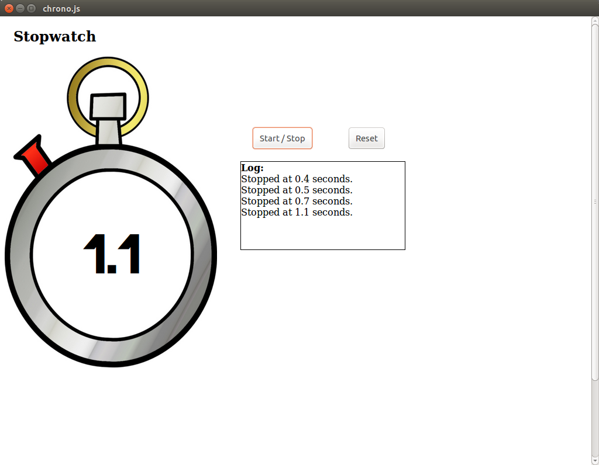

# Chrono.js

This is a very simple stopwatch programmed in javascript.  

It can be run either in a browser, in a smartphone (it detects touch events from tactile screens) or it can even be installed in your computer.  

It supports two languages: chrono.html for English and chrono-es.html for Spanish.

# If you want to try it
For trying out the web app, just go to [this link](akronix.github.io/chrono.js/index.html) where there is a hosted version.  
Also you can install it as an application in your device, in order to do that just [enter here](http://akronix.github.io/chrono.js/install/).

# Other
Information regarding license and attributions can be found in the LICENSE.md file.

Let me know if you find any problem or if you have any suggestion.
